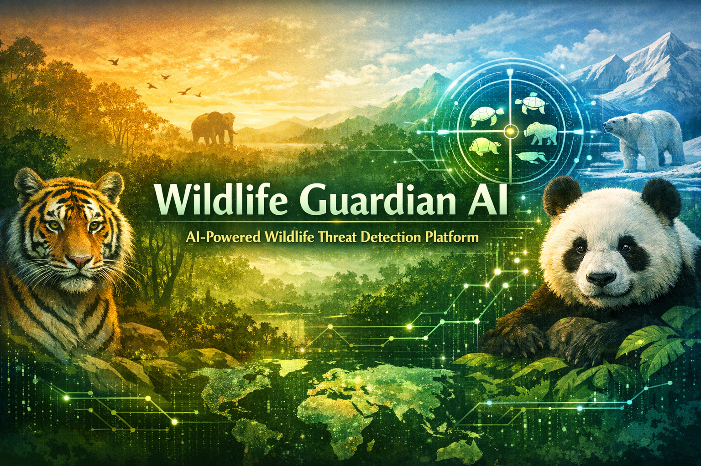

# 🐾 Wildlife Guardian AI

Wildlife Guardian AI is an **AI-powered environmental intelligence platform** designed to detect wildlife threats from images and generate a **Wildlife Risk Score** to help identify animals that may be in danger.

The system combines **computer vision, environmental threat mapping, and AI-generated insights** to assist conservation awareness and decision-making.

---

# 🌍 Problem

Wildlife across the world faces increasing threats including:

- Poaching
- Plastic pollution
- Habitat destruction
- Climate change
- Human encroachment

Most systems identify problems **after damage occurs** and lack a simple, visual way to highlight wildlife risk globally.

---

# 💡 Solution

Wildlife Guardian AI provides an intelligent system that:

1. Detects animals from uploaded images
2. Identifies environmental threats present in the scene
3. Calculates a **Wildlife Risk Score (0–100)**
4. Explains why the animal may be at risk
5. Visualizes wildlife threat locations using a **global heatmap**

This allows researchers, conservation groups, and citizens to **quickly understand wildlife risk situations**.

---

# 🚀 Key Features

- 🦁 **Animal Detection**
  - Detects species from uploaded images using AI models.

- ⚠ **Threat Identification**
  - Recognizes threats such as plastic waste, fire, deforestation, or human activity.

- 📊 **Wildlife Risk Score**
  - Generates a score between **0 and 100** to indicate threat severity.

- 🧠 **AI Risk Explanation**
  - Provides simple explanations for why the animal is considered at risk.

- 🗺 **Global Heatmap Visualization**
  - Displays detected wildlife threats on a global map.

---

# 📊 Risk Score Logic

Wildlife risk is calculated using two factors:

---

# 📂 Project Structure

WildlifeGuardianAI
│
├ README.md
├ species_dataset.md
├ threat_mapping.md
├ test_cases.md
├ research_notes.md
├ model_logic.md
├ future_scope.md
│
└ examples
tiger.jpeg
black_rhino.jpeg
sea_turtle.jpeg
polar_bear.jpeg
...

---

# 🧪 Example Species

Some species included in the dataset:

- Tiger
- Black Rhinoceros
- Sea Turtle
- Polar Bear
- Snow Leopard
- Orangutan
- Giant Panda
- Blue Whale
- Pangolin
- Asian Elephant
- Red Panda

Example images are stored inside the **examples folder**.

---

# 🛠 Technologies Used

- Artificial Intelligence (Computer Vision Models)
- Image Classification / Object Detection
- Data Analysis
- HTML / CSS (Frontend Prototype)
- GitHub for collaboration

---

# 👥 Team Roles

**AI / Logic**

- Integrates detection models
- Calculates Wildlife Risk Score
- Connects AI outputs with system logic

**Frontend**

- Builds user interface
- Handles image upload and visualization
- Displays results and map

**Research / QA**

- Creates species datasets
- Designs test cases
- Validates threat mapping
- Prepares research documentation

---

# 🔮 Future Scope

- Integration with **satellite imagery**
- Real-time monitoring with **camera traps**
- Mobile app for **citizen wildlife reporting**
- NGO and conservation organization collaboration
- Advanced AI models for species-level classification

---

# 🌱 Impact

Wildlife Guardian AI aims to support global conservation efforts by providing a **simple, visual, and intelligent system** for detecting wildlife threats and raising awareness about endangered species.

---

⭐ Built for **Global AI Hackathon**
