# Threat Mapping – Wildlife Guardian AI

## Purpose
This document explains how different environmental and human-related threats affect wildlife species and how the system calculates the **Wildlife Risk Score**.

It also helps align:
- species dataset
- AI threat detection
- test cases
- global heatmap visualization

---

## Threat Types Overview

| Threat Type               | Risk Weight |
|---------------------------|-------------|
| Poaching                  | 25          |
| Plastic Pollution         | 20          |
| Habitat Loss              | 18          |
| Climate Change            | 20          |
| Ship Collisions / Fishing | 15          |
| Wildfire                  | 15          |
| Invasive Species          | 10          |
| Water Pollution           | 15          |
| Human Encroachment        | 15          |

**Note:**  
The **Risk Weight** is added to the species **Base Risk** (from IUCN Red List status) to calculate the final **Wildlife Risk Score**.  
The maximum score is capped at **100**.

---

# Threat Details & Examples

## 1. Poaching

**Example Species:** Tiger, Black Rhinoceros, Pangolin  
**Region:** Africa, Asia (especially protected areas)
**Impact:**  
Critically Endangered species face extremely high risk due to illegal hunting.
**AI Detection Notes:**
- Detect humans near wildlife
- Possible weapons or traps
- Suspicious human activity in wildlife zones

---

## 2. Plastic Pollution

**Example Species:** Sea Turtle, Leatherback Turtle  
**Region:** Oceans and coastal ecosystems
**Impact:**  
Animals may ingest plastic or become entangled, leading to injury or death.
**AI Detection Notes:**
- Floating plastic debris
- Plastic bags or bottles near marine animals

---

## 3. Habitat Loss

**Example Species:** Orangutan, Giant Panda, Snow Leopard  
**Region:** Tropical forests and mountainous ecosystems
**Impact:**  
Deforestation and urban expansion reduce natural habitats.
**AI Detection Notes:**
- Deforested land patches
- Roads or buildings near wildlife areas

---

## 4. Climate Change

**Example Species:** Polar Bear  
**Region:** Arctic ecosystems
**Impact:**  
Melting sea ice reduces hunting areas and survival chances.
**AI Detection Notes:**
- Ice coverage reduction
- Large water areas in polar environments

---

## 5. Ship Collisions / Fishing

**Example Species:** Blue Whale, Whale Shark  
**Region:** Major ocean shipping routes
**Impact:**  
Large marine animals can be injured by ships or fishing nets.
**AI Detection Notes:**
- Ships or boats near marine species
- Fishing nets or equipment

---

## 6. Wildfire

**Example Species:** Forest wildlife species  
**Region:** Forest ecosystems prone to seasonal fires
**Impact:**  
Wildfires destroy habitats and force animals to migrate.
**AI Detection Notes:**
- Smoke
- Fire
- Burnt vegetation

---

## 7. Invasive Species

**Example Species:** Red Panda, Giant Panda  
**Region:** China and Himalayan ecosystems
**Impact:**  
Non-native species disrupt local ecological balance.
**AI Detection Notes:**
- Unusual plant or animal presence in habitat

---

## 8. Water Pollution

**Example Species:** River Dolphins, Amphibians  
**Region:** Rivers and freshwater ecosystems
**Impact:**  
Chemical pollution and waste reduce water quality and survival rates.
**AI Detection Notes:**
- Murky or contaminated water
- Visible industrial or plastic waste

---

## 9. Human Encroachment

**Example Species:** Snow Leopard, Orangutan  
**Region:** Mountain villages and forest-edge areas
**Impact:**  
Urban expansion and tourism disturb wildlife habitats.
**AI Detection Notes:**
- Roads
- Buildings
- Human settlements near wildlife

---

# Risk Score Calculation

Each species receives a **Base Risk Score** based on its conservation status in the **IUCN Red List**.

| Status                     | Base Risk |
|----------------------------|-----------|
| CR – Critically Endangered | 95        |
| EN – Endangered            | 85        |
| VU – Vulnerable            | 70        |

### Formula

**Wildlife Risk Score = Base Risk + Threat Weight**
Maximum Score = **100**
---

# Example Calculations

| Animal     | Base Risk | Threat                  | Final Score | Priority |
|------------|-----------|-------------------------|-------------|----------|
| Tiger      | 85        | Poaching +25            | 100         | High     |
| Sea Turtle | 90        | Plastic Pollution +20   | 100         | High     |
| Polar Bear | 70        | Climate Change +20 | 90 | Medium-High |

---

# Notes for Hackathon MVP

- AI analyzes **images or videos** to detect wildlife and environmental threats.
- Threat weights can be **adjusted in future versions**.
- Risk scores help identify **high priority conservation areas**.
- The system can visualize results using a **global threat heatmap**.

### Multiple Animal Detection

If an image contains multiple animals, the AI system detects each species individually and calculates a separate Wildlife Risk Score.
The system highlights the species with the highest risk score as the primary alert for conservation priority.

### Future Improvements
- Satellite image integration
- Real-time wildlife monitoring
- NGO collaboration for conservation alerts

---

## Example Species Images

The following images are sample inputs used to test the Wildlife Guardian AI detection system.  
These examples help demonstrate how the AI model detects wildlife species and associates them with potential environmental threats.

---

### Tiger
Threat: Poaching

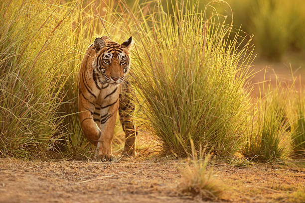

---

### Black Rhinoceros
Threat: Poaching

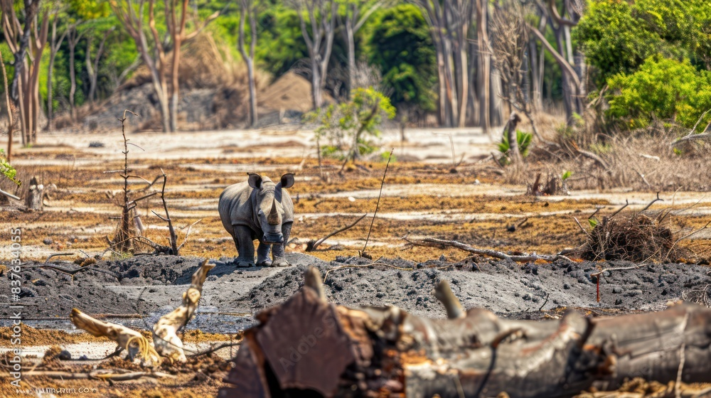

---

### Sea Turtle
Threat: Plastic Pollution

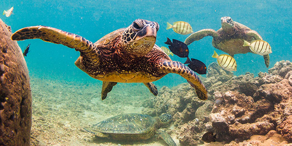

---

### Polar Bear
Threat: Climate Change

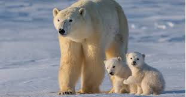

---

### Orangutan
Threat: Habitat Loss

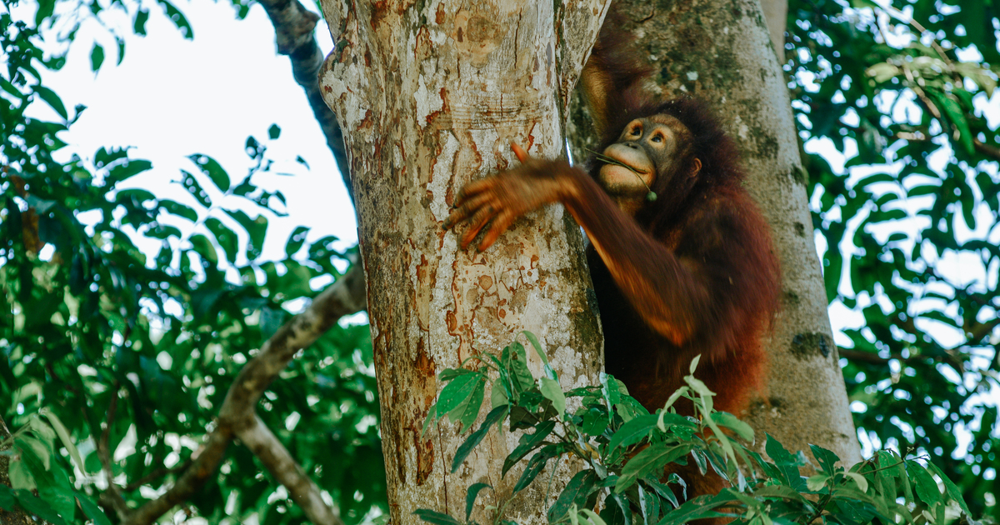

---

### Snow Leopard
Threat: Human Encroachment / Habitat Loss

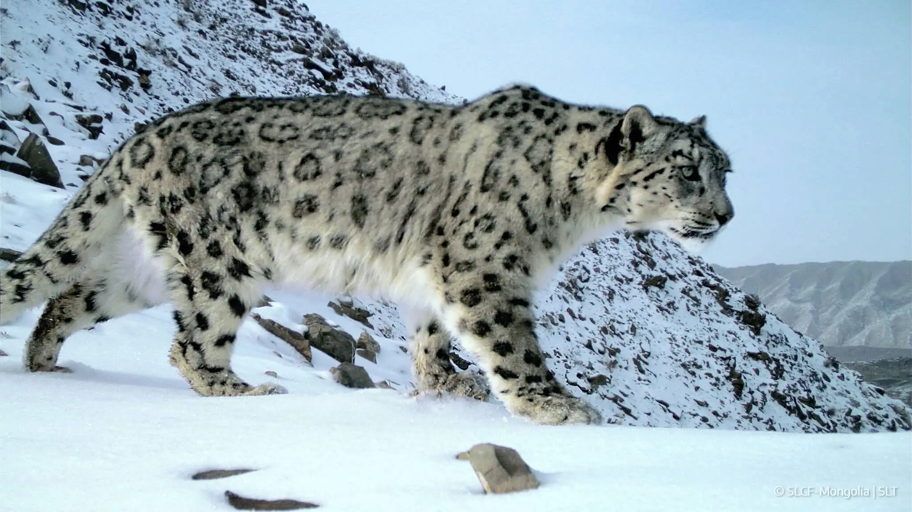

---

### Giant Panda
Threat: Habitat Loss

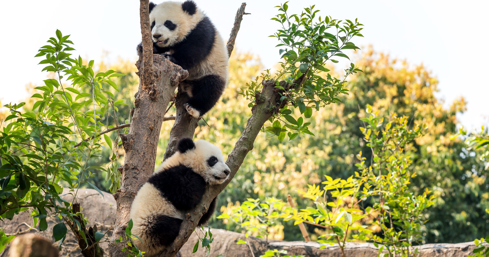

---

### Blue Whale
Threat: Ship Collisions / Fishing Nets

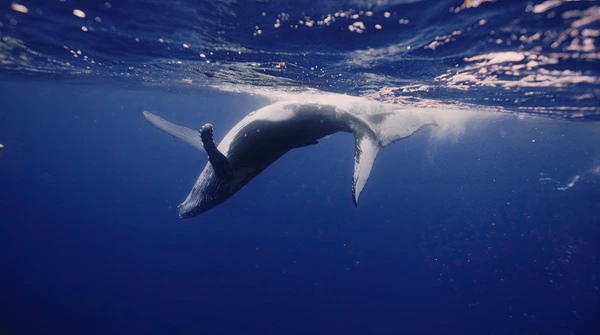

---

### Whale Shark
Threat: Fishing Nets / Plastic Pollution

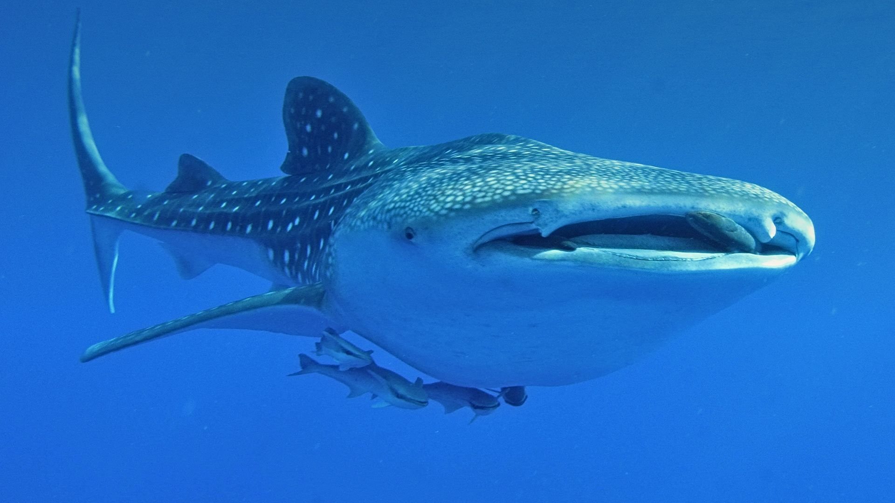

---

### Pangolin
Threat: Poaching

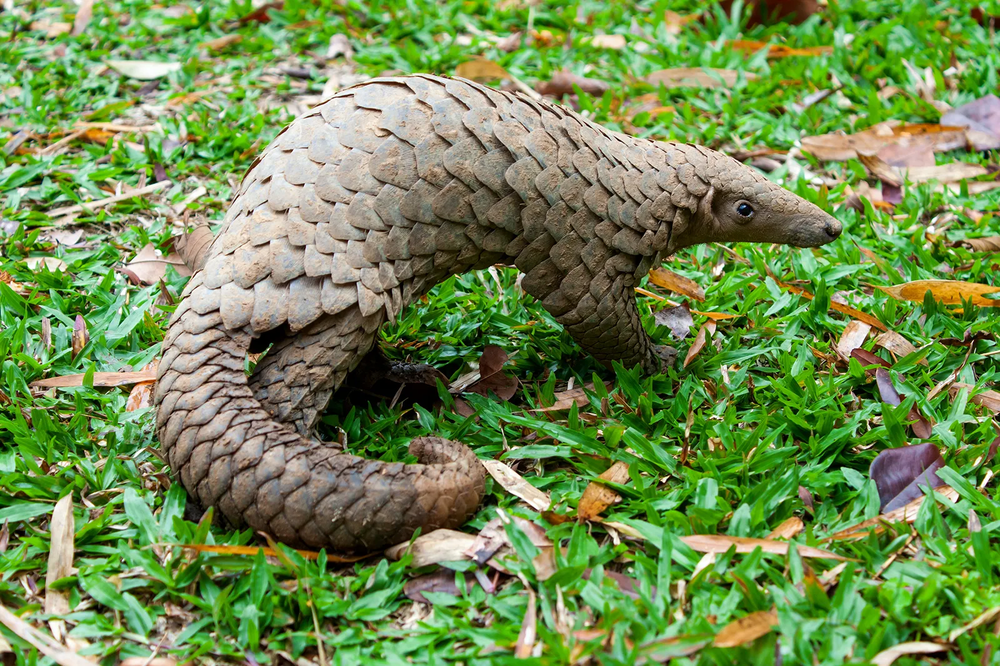

---

### Asian Elephant
Threat: Human Encroachment

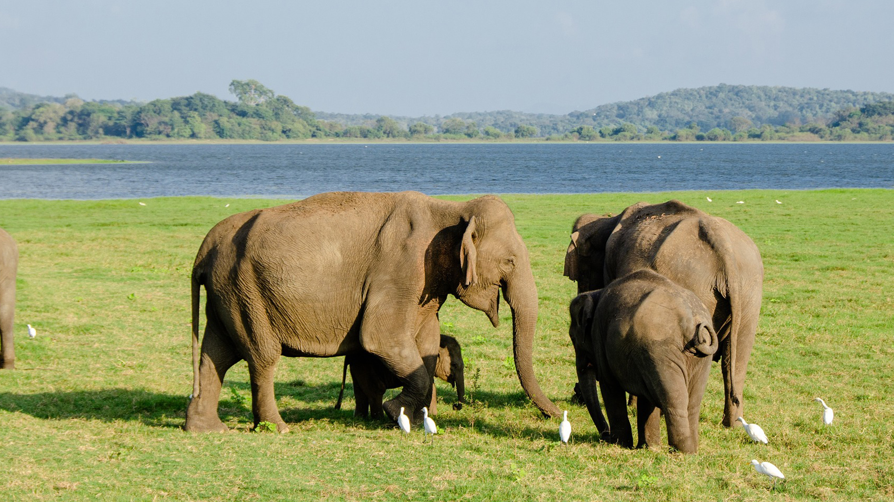

---

### Red Panda
Threat: Habitat Loss

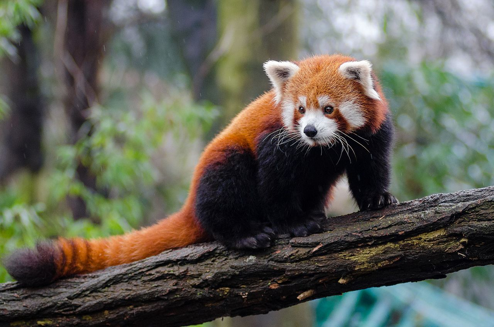

---

### River Dolphin
Threat: Water Pollution

---

### Lion
Threat: Habitat Loss / Human Conflict

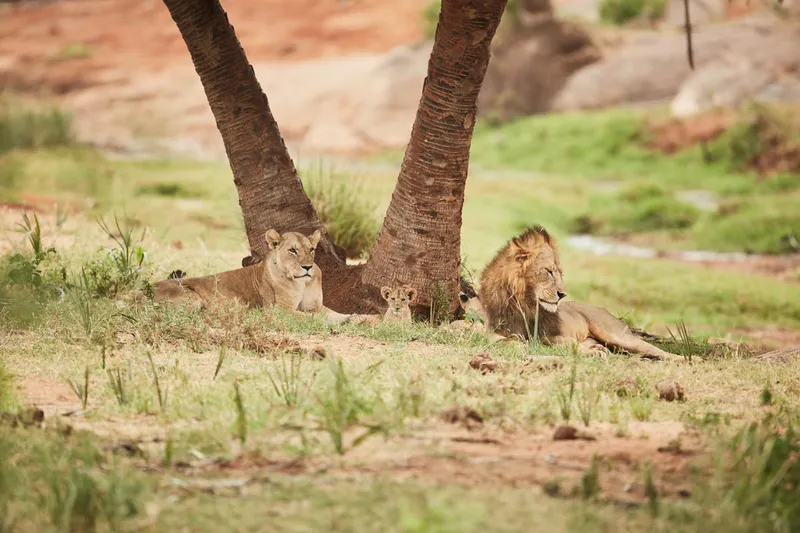

---

### Gorilla
Threat: Poaching / Habitat Loss

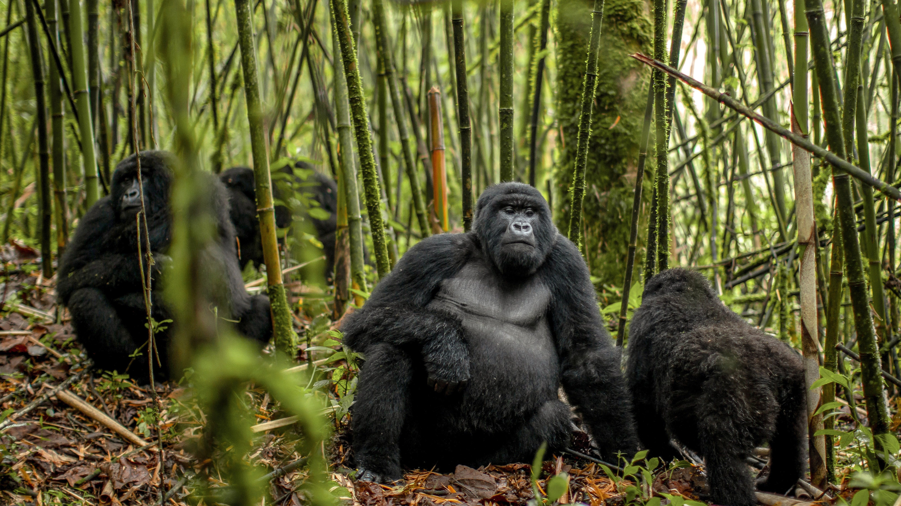

---

### Leopard
Threat: Human Encroachment

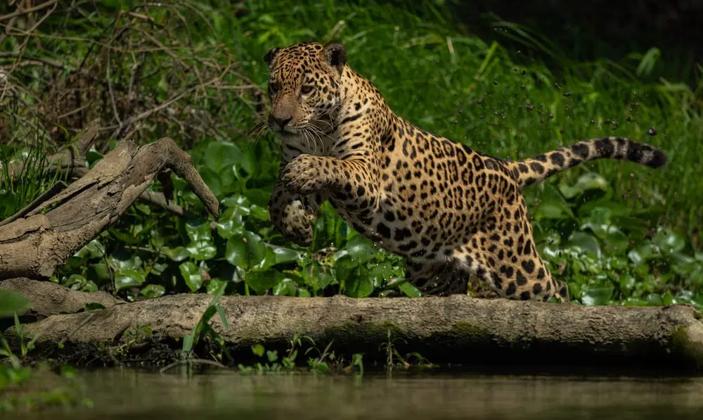

---

### Kangaroo
Threat: Wildfire / Climate Change

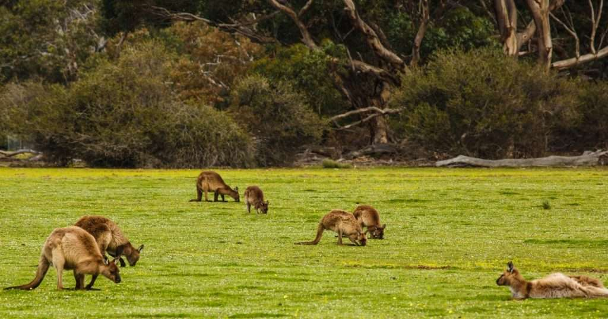